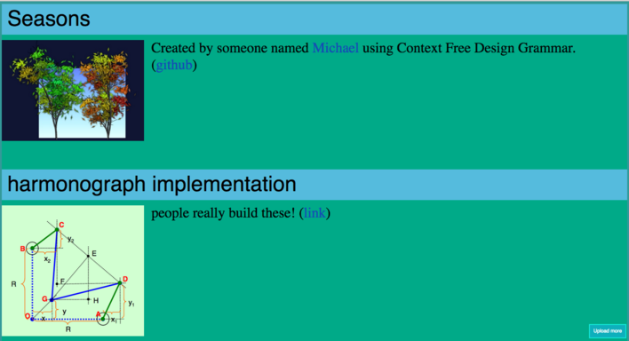

# swipefile
Inspired by *Steal Like an Artist*, a web-based swipe file app to stash away ideas that inspires you.  
Be sure to give credit to original creators.

## Warning!
Before you put this on your website, learn how [htaccess](https://www.seas.upenn.edu/cets/answers/auth-htpasswd.html) works and use it in the upload/ directory.  Otherwise, who knows what kinds of crazy content people might throw onto your site?  Another option is to put it in the root swipefile directory, to keep the whole thing private.

## TODO
* On upload, use ImageMagick to create a smaller version to reduce load times.  Image links to copy of the original file.
* Only load so many at a time
* Allow editing filenames
* Add search
